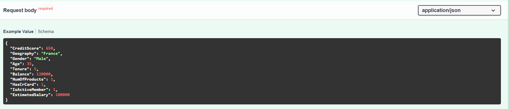
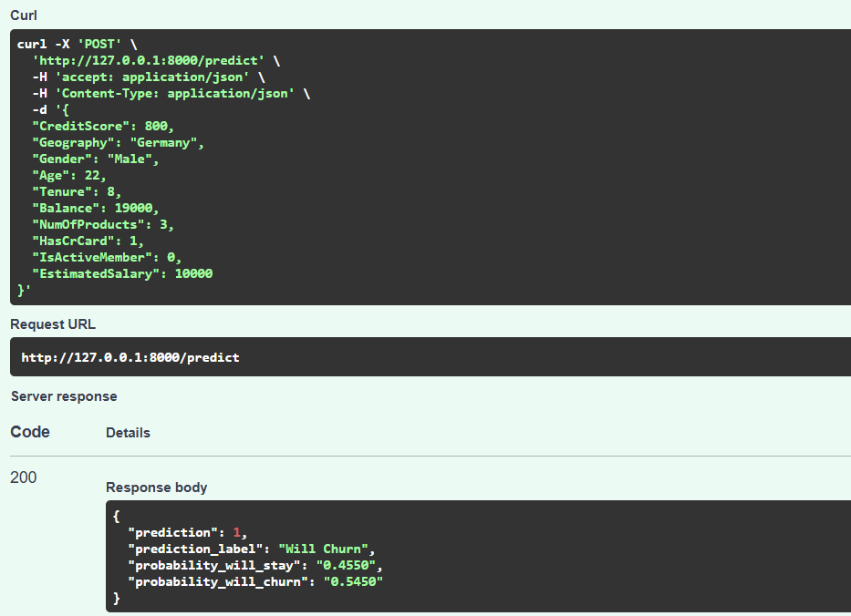

# Bank Customer Churn Prediction

A complete, end-to-end machine learning project to analyze and predict bank customer churn, compare models, track experiments, and serve real-time predictions via an API.

## 📁 Project Contents

- `Churn_Modelling.csv` — Source dataset
- `Churn.ipynb` — Notebook with EDA, feature engineering, modeling, and evaluation
- `final_churn_model.pkl` — Trained Random Forest model
- `scaler.pkl` — MinMaxScaler fitted on training data
- `app.py` — FastAPI app to serve predictions
- `requirements.txt` — Python dependencies for the API
- `Notes and Plan.txt` — Cleaned insights and retention plan
- `Business Impact.txt` — Business impact notes
- `mlruns/` — MLflow experiment runs (local tracking)

Key visuals used below are in this folder:
- `Model compare.PNG`
- `RF MLflow.PNG`
- `schema.PNG`
- `Prediction.PNG`
- `Fast Api.PNG`

---

## 1) Dataset and EDA Highlights

From exploratory analysis in the notebook:

- Credit score: Many churners fall between 600–700.
- Age: Highest churn in the 30–40 range; decreases for older customers.
- Balance: Two notable churner groups — zero balance and high balance ($100k–$150k).
- Geography: Germany shows the highest churn rate (~32%).
- Gender: Females churn more than males (though males are more numerous overall).
- Product count: Very high churn for customers with 3–4 products; all customers with 4 products churned (tiny segment; treat with caution).

Model comparison (5-fold CV, original vs SMOTE training sets):


---

## 2) Feature Engineering and Preprocessing

- Dropped IDs (`RowNumber`, `CustomerId`, `Surname`).
- Encoded `Gender` (Male=1, Female=0) and one-hot encoded `Geography` (drop-first).
- Engineered:
  - `Balance_to_Salary = Balance / (EstimatedSalary + 1)`
  - `Credit_Stability = CreditScore / (Age + 1)`
- Train/test split with stratification.
- Scaled continuous features with `MinMaxScaler`.
- Addressed class imbalance using SMOTE on the training set only.

---

## 3) Modeling and Selection

- Baseline models compared: Logistic Regression, Decision Tree, Random Forest, XGBoost.
- Training on SMOTE data improved results across models.
- Selected model: Random Forest (best F1-Score on validation and on the test set).

Experiments tracked in MLflow:


---

## 4) Final Model and Artifacts

- Final optimized Random Forest saved to `final_churn_model.pkl`.
- Scaler saved to `scaler.pkl`.
- Notebook includes final evaluation (classification report, confusion matrix, feature importances).

---

## 5) Serving Predictions (FastAPI)

The project includes a FastAPI app (`app.py`) that loads the trained model and scaler, applies the same preprocessing steps, and returns a churn prediction and probabilities.

API schema example:



Prediction example in docs:



FastAPI docs (Swagger UI):


### Run the API locally (Windows PowerShell)

```powershell
# (Optional) create and activate a virtual environment
# python -m venv .venv; . .venv\Scripts\Activate.ps1

# Install dependencies
pip install -r requirements.txt

# Start the server (reload for dev)
uvicorn app:app --reload
```

Open http://127.0.0.1:8000/docs to try the interactive UI.

---

## 6) Experiment Tracking (MLflow)

Experiments for cross-validation and test evaluations are logged locally in `mlruns/`.

```powershell
# Optional: launch the MLflow UI (if mlflow is installed and on PATH)
mlflow ui
```

Then open http://127.0.0.1:5000 to explore runs, parameters, and metrics.

---

## 7) Business Insights and Retention Plan

See:
- `Notes and Plan.txt` — Curated insights and a structured retention plan
- `Business Impact.txt` — Business impact considerations

Key actions derived from insights:
- Target Germany with loyalty and dedicated support.
- Tailor offers and communications for female customers.
- Two-pronged approach for balance extremes: incentives for zero balance; premium service for $100k–$150k segment.
- Review product bundles for customers with >2 products; prevent overload and confusion.
- Focus digital-first initiatives for the 30–40 segment.

---

## 8) Reproducing the Analysis

Open `Churn.ipynb` and run cells in order. Ensure the following packages are available in your notebook environment:

- pandas, numpy, seaborn, matplotlib
- scikit-learn
- imbalanced-learn (SMOTE)
- xgboost
- mlflow (for tracking inside the notebook)

If you only intend to use the API, `requirements.txt` is sufficient.

---

## 9) Troubleshooting

- If `mlflow` command is not recognized in terminal, install it (`pip install mlflow`) or use the notebook `%pip install mlflow` so it’s available to that kernel.
- If predictions fail, ensure both `final_churn_model.pkl` and `scaler.pkl` exist and match the preprocessing steps.
- Spaces in image filenames are supported via URL-encoding (`%20`). If your Markdown viewer does not render images, rename files without spaces and update paths accordingly.
